# 13 лабораторна робота React/TypeScript + ASP.NET Core API + Auth0

Застосунок ділиться на дві частини. FE - React/TypeScript SPA який робить Login\Signup за допомогою Auth0.
Дурга частина застосунку ASP.NET Core API який має публічні та приватні ендпоінти, приватні ендпоінти потребують перевірки токена логіну користувача та перевірки його на правдивість.
Таким чином ми маємо повністю захищений фулстек застосунок який має перевірки як на стороні користувача, так і на стороні сервера, що дає змогу захистити ендпоінти.

## Для роботи нам потрібно налаштувати сервіс Auth0 за допомогою їх веб сайту:
1) Створимо необхідний сервіс для SPA React:
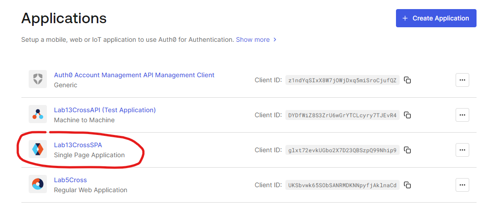

Де в налаштуваннях ми можемо отримати необхідну нам інформацію для використання:
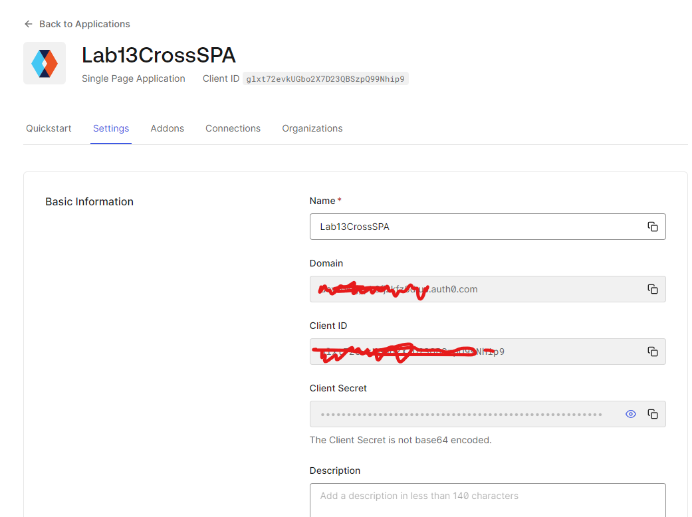

Та налаштуємо посилання для переадресації користувача під час логіну:
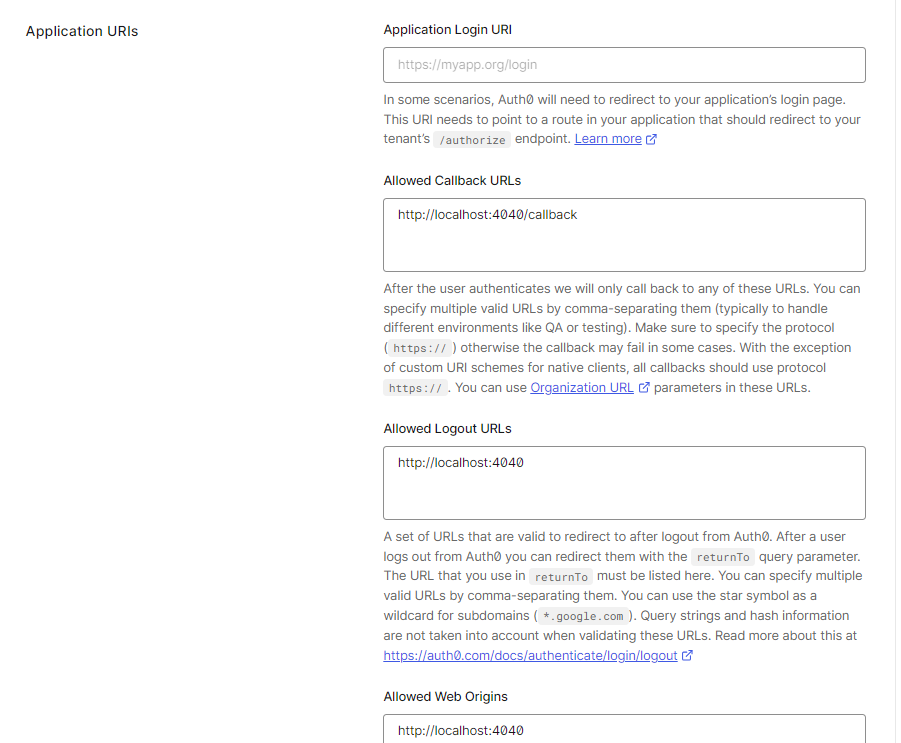

2) Налаштуємо сервіс API. Який надасть нам змогу робити перевірку токену користувача на бекенді.
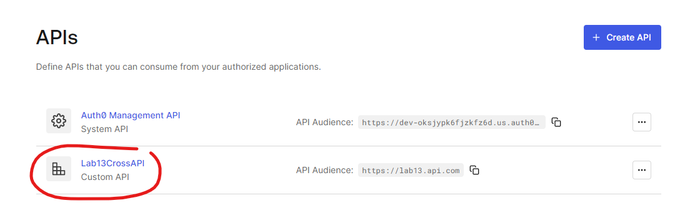

Ми отримаємо ось такі налаштування для використання в проекті ASP.NET
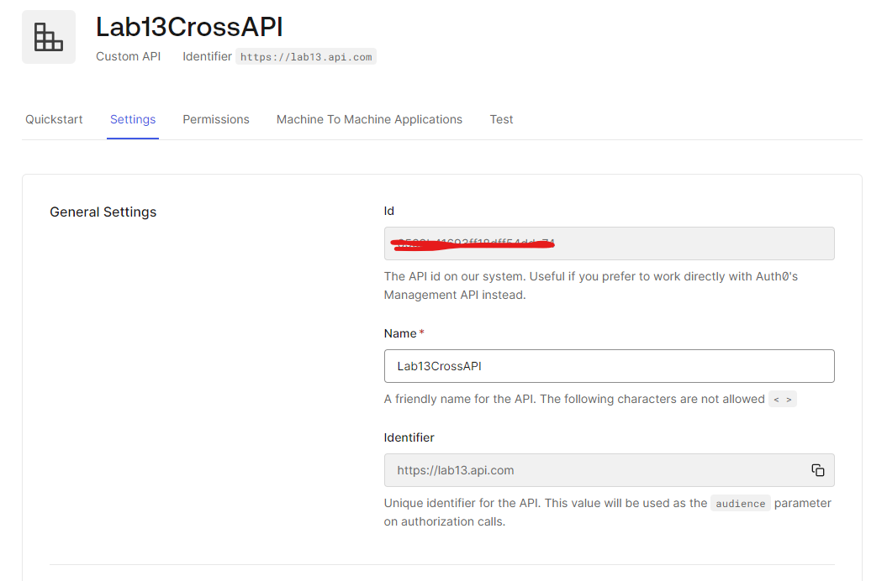

## !!! Дані налаштування ми помістимо в .env файли для конфігурації проекту.

## Було створено React/TypeScript SPA застосунок з використанням Auth0:
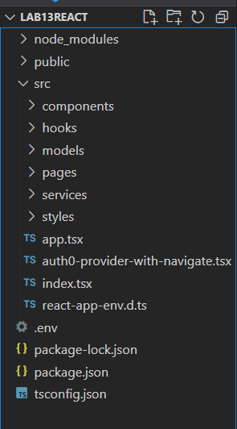

Та отримали ось такий інтерфейс:
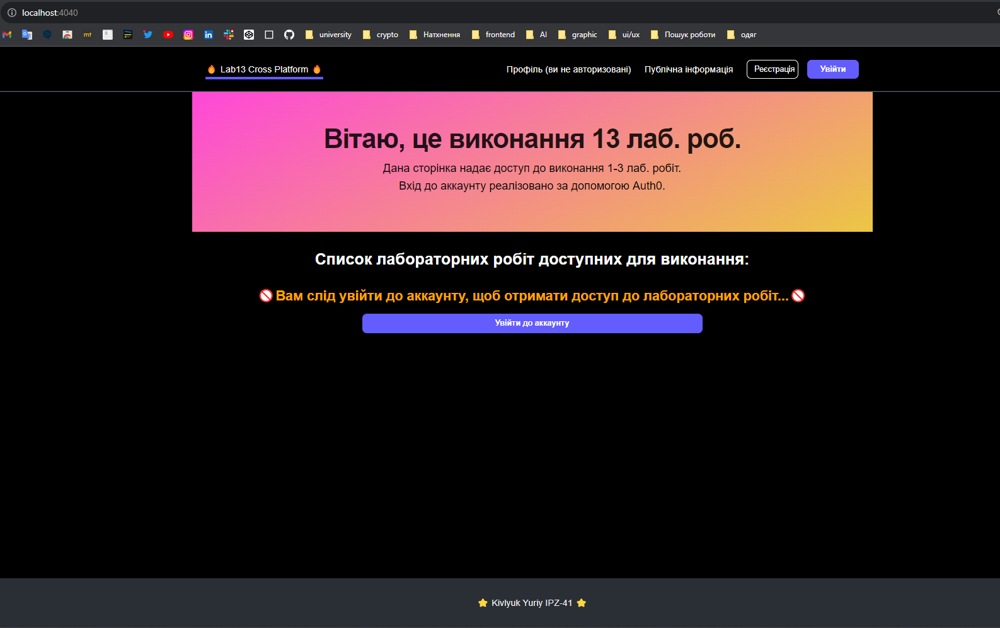

Як можна побачити ось так виглядає інтерфейс незалогіненого користувача.
Для прикладу було розроблено роут який абсолютно не потребує перевірки та доступний в табі "Публічна інформація":
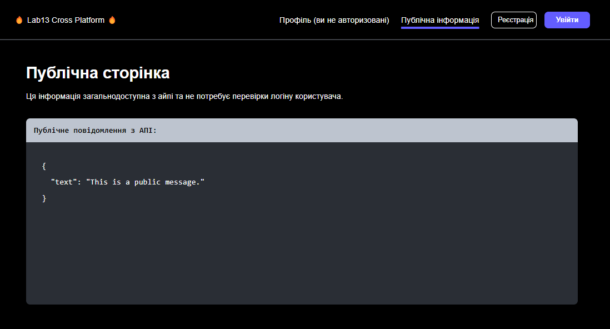

### При спробі перейти за посиланням на пряму (http://localhost:4040/lab2) нас перекине на форму логіну.

Якщо ми спробуємо перейти на сторінку профілю, то нас перекине на форму для входу в акаунт:
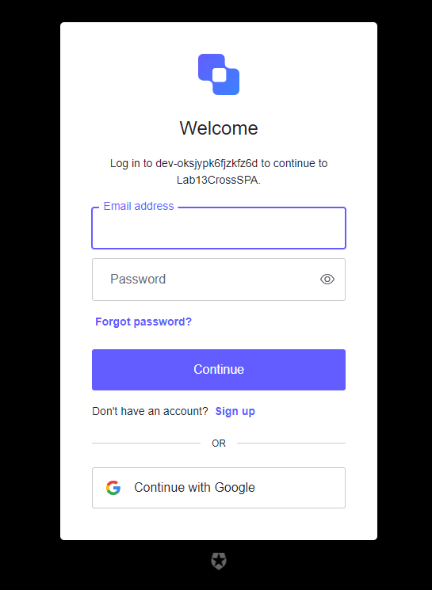

Після провдеення логіну можна отримати доступ до нових шляхів в застосунку:

Сторінка користувача:
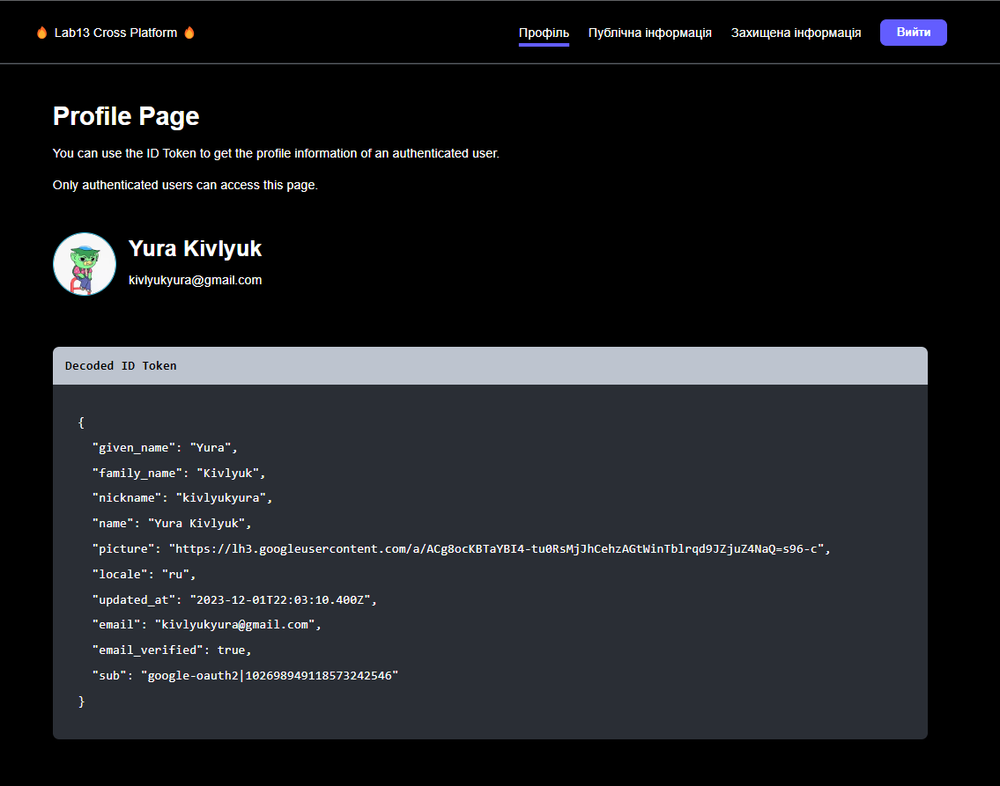

Сторінка приватного роуту (який потребує токену):
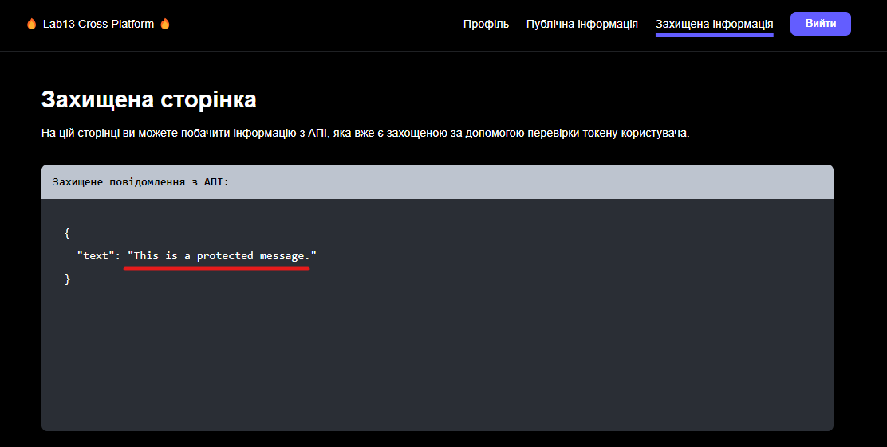

А також доступ до лабораторних робіт:
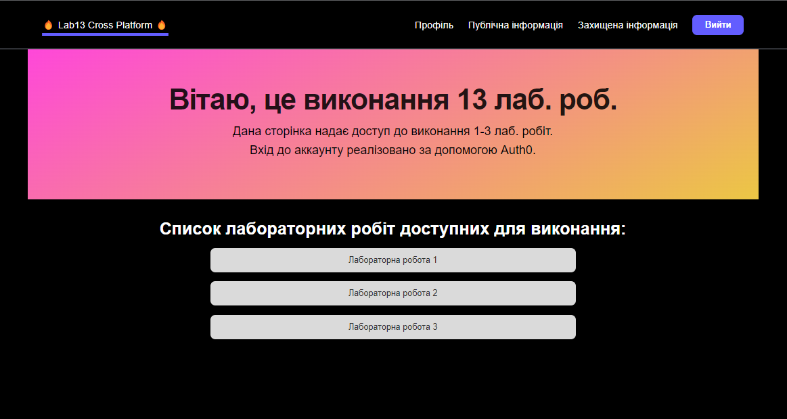

Приклад сторінки другої лабораторної:
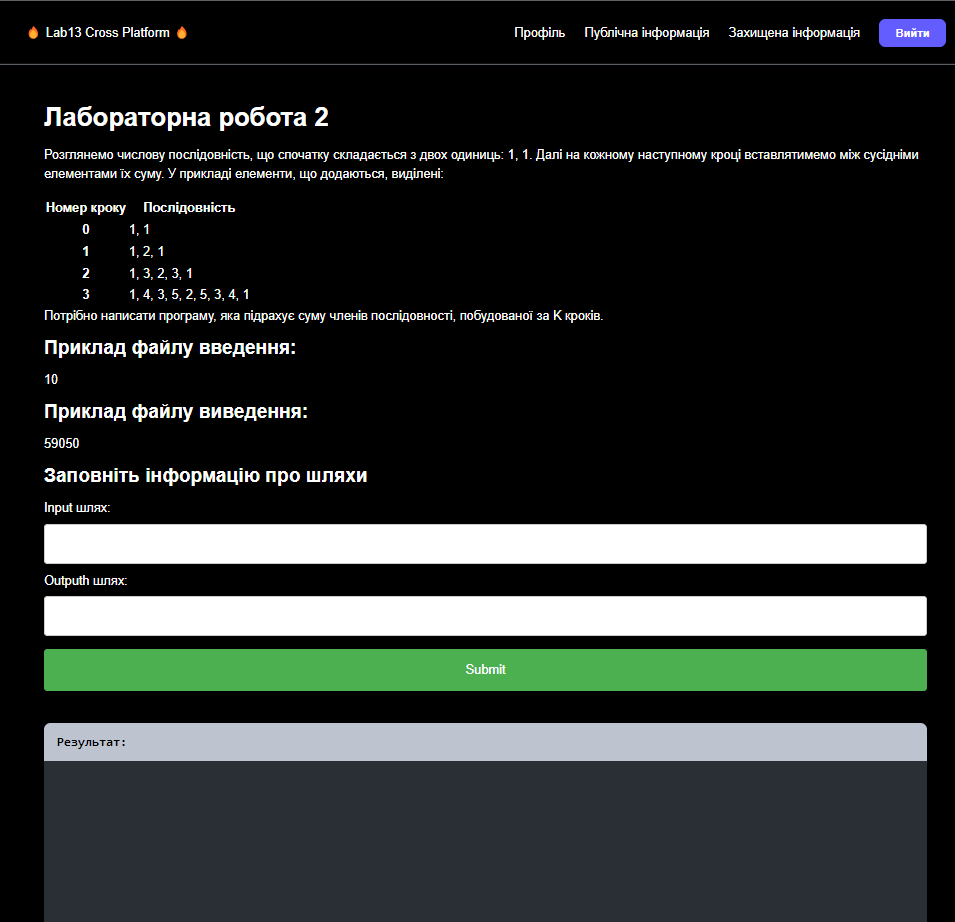

### !!! При виконанні методів лабораторних робіт інформація з форми надсилається разом з токеном для перевірки користувача.

## Як бекенд було розробено ASP.NET Core API з використанням Auth0 можливостей.
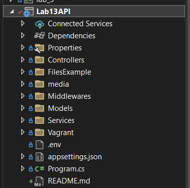

Ось як приблизно виглядають ендпоінти нашого застосунку разом з перевірками на авторизованість:
1) Наприклад відправлення Message для приватного та публічного роуту:
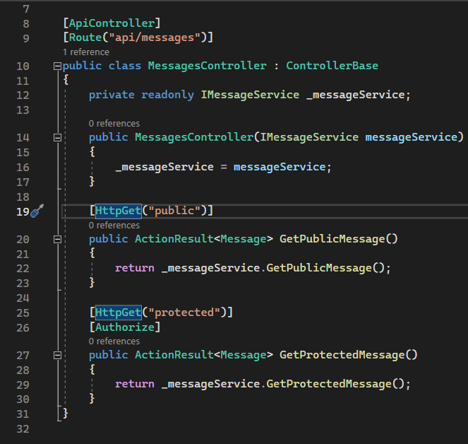

По аналогії так само захищено і інші ендпоінти на виконання лабораторних робіт.

Спробуємо надіслати запит на отримання публічної інформації:
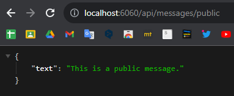

Спробуємо надіслати запит на отримання приватної інформації (без токену):
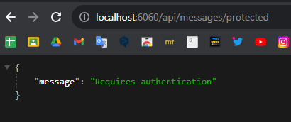

### Протестуємо виконання лаборатрних робіт:
Для виконання в проекті були створені заготовки з файлів:
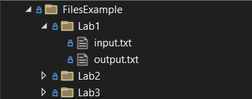

1) Успішне виконання завдання:
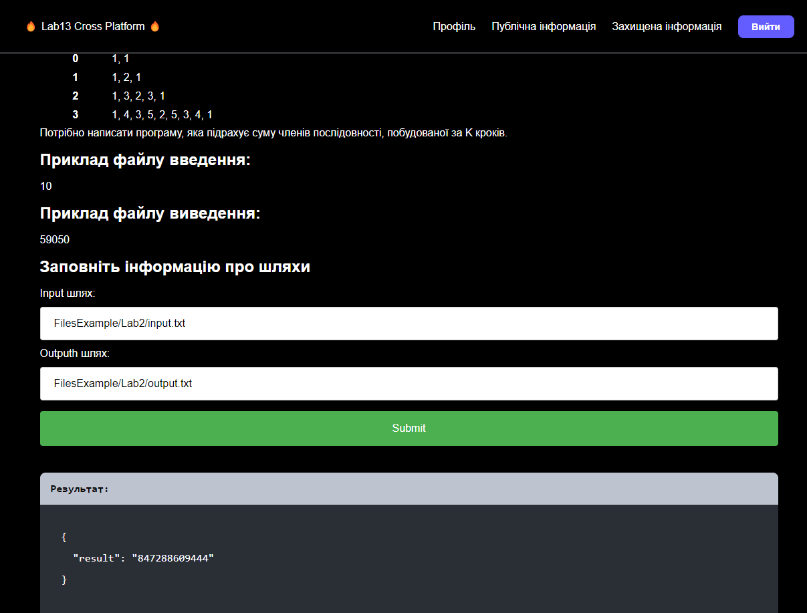

2) Помилка в шляху:
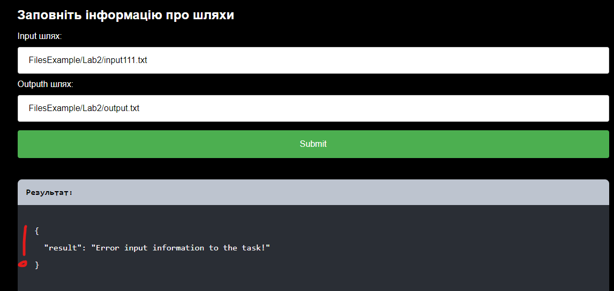

3) Приклад ще одної лабораторної:
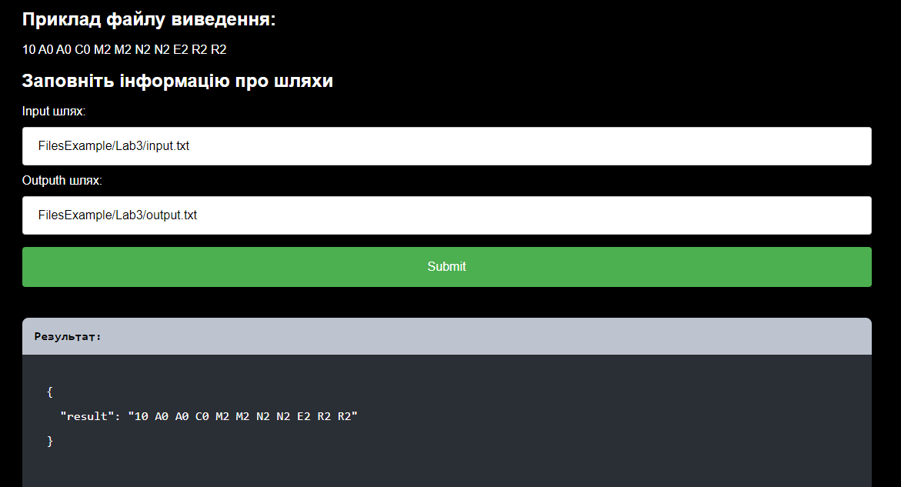

#### При спробі отримати доступ до лабораторної без необхідної інформації про користувача буде отримано помилку
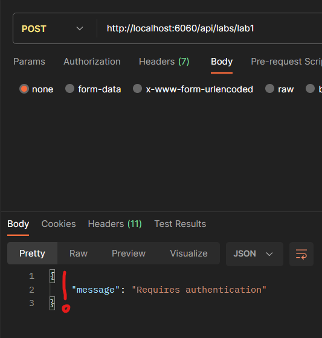

## Також було створено кофігураційний Vagrantfile для запуску застосунків на Linux. Для отримання доступу до них в ВМ було прокинуто необхідні порти.
