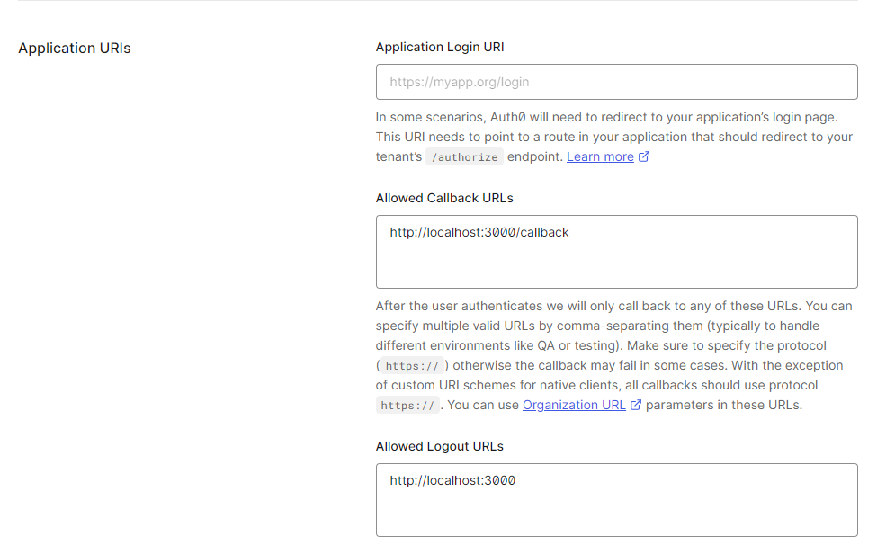
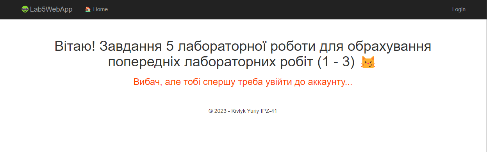

## Першочергово було створено бібліотеку класів:

## Далі створено застосунок ASP.NET MVC:

Розроблено Ммоделі, контролри та представлення:

## Для реєстрації та аутентифікації використаємо запропонований ресурс - Auth0 від Okta
Створено застосунок для нашого додатку та проведено налаштування:

Налаштування для переадресації користувача:

### В нашому веб застосунку зробимо установку необхідного nuget пакету для роботи:

Налаштування проведено згідно інстракції на сервісі Auth0 для ASP.NET Core MVC застосунку.

## Далі запустимо наш додаток локально:

Логін:

Залогінений юзер:

Завдання лабораторної роботи (приклад першої лабораторної):

Профіль користувача:

## Приклад виконання 3 лабораторної роботи:

Результат:

## За допомогою Вагрант файлу запустимо наш застосунок на ОС Лінкус за допомогою ВМ:
