### Першочергово по завданню було розроблено бібліотеку класів та консольний застосунок за допомогою якого буде здійснюватись керування:
### 1. Консольний застосунок:
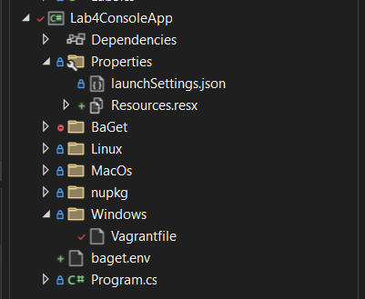

### При цьому у розробці було використано допоміжний пакет для передачі аргументів через командний рядок до програми, а саме було це зроблено за допомогою  CommandLineUtils.
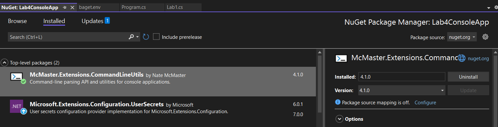

### 2. Бібліотека класів:
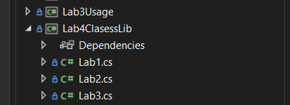

При цьому код програм було дещо змінено, та додано до класів окремий метод для запуску коду лабораторних робіт:
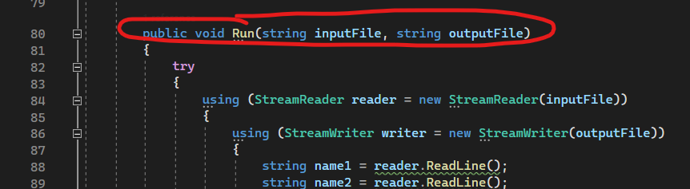

### Для того щоб запакувати застосунок проведемо наступну конфігурацію Lab4ConsoleApp.csproj:
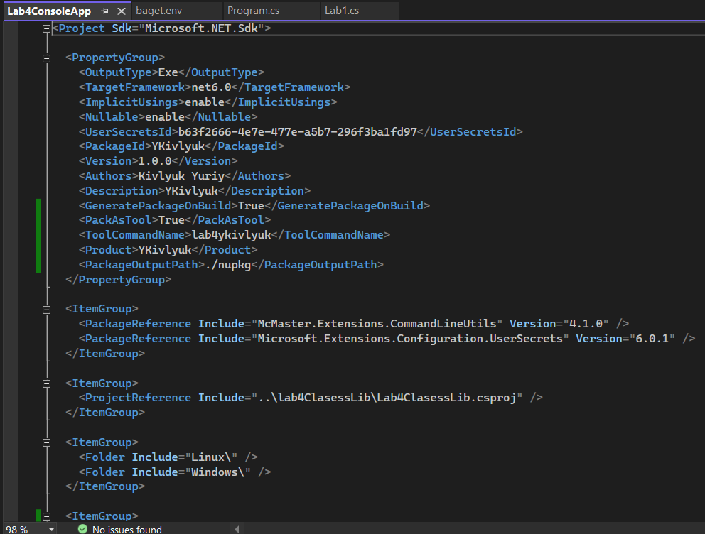

Далі по завданню необхідно запустити локальний менеджер пакетів NuGet за допомогою BaGet.
Як варіант запуску такого сервісу використаємо Docker для завантаження image для роботи, а також запуску локального сервісу як контейнера для роботи.

### Необхідно створити конфігураційний файл для BaGet:
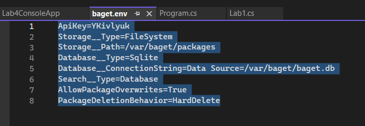

Далі за допомогою Docker та команди можемо запустити контейнер: 
<code>docker run --name baget-ykivlyuk -p 5000:80 --env-file baget.env -v ./baget-data:/var/baget loicsharma/baget</code>
Контейнер буде доступний на порту 5000 на комп'ютері.  
Після чого ми отримаємо готовий контейнер та ресурс запущений локально:
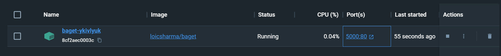
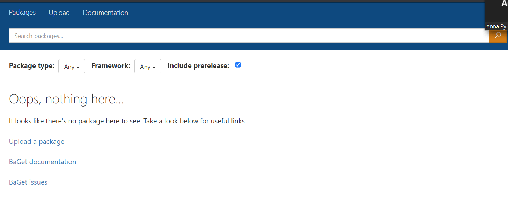

Далі слід завантажити наш пакет на ресурс, відповідно запакуємо наш застосунок як dotnet tool: 
<code>dotnet pack --configuration Release</code>
Після чого отримаємо файл:
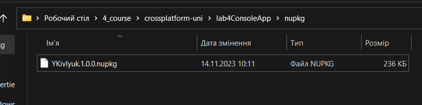

 За допомогою наступної команди завантажимо наш пакет в менеджер пакетів: 
<code>dotnet nuget push -s http://localhost:5000/v3/index.json -k YKivlyuk ./nupkg/YKivlyuk.1.0.0.nupkg</code>
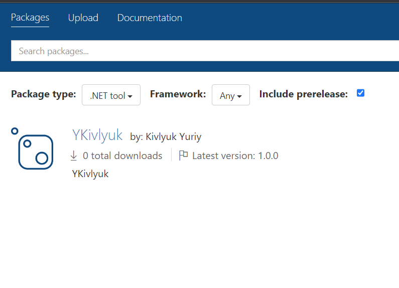

### Встановимо даний dotnet tool на наш ПК для тестування: 
<code>dotnet tool install --global --version 1.0.0 --add-source http://localhost:5000/v3/index.json --no-cache YKivlyuk</code>
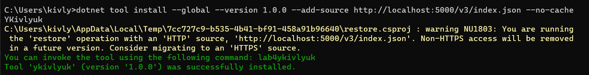

Після чого проведемо тестування роботи:
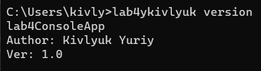

Протестуємо запуск одної з лабораторних робіт:
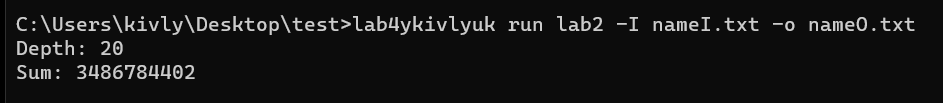

### Далі слід розгорнути три віртуальні машини (Windows, Linux, MacOs) за допомогою Vagrant. 
В першу чергу давайте запустимо Windows віртуальну машину:
1) створимо файл з налаштуваннями ВМ
2) запустимо ВМ за допомогою команди vagrant up та після виконаємо provision.

Після чого отримуємо ось такий результат за допомогою консолі:
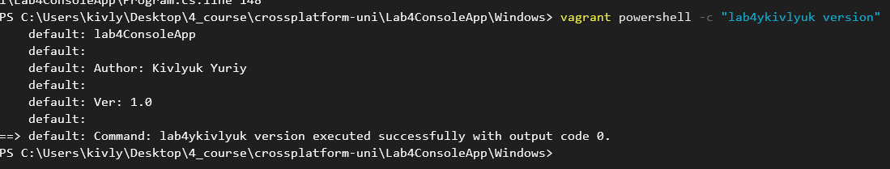

Запустимо ВМ за допомогою VirtualBox та графічного інтерфейсу:
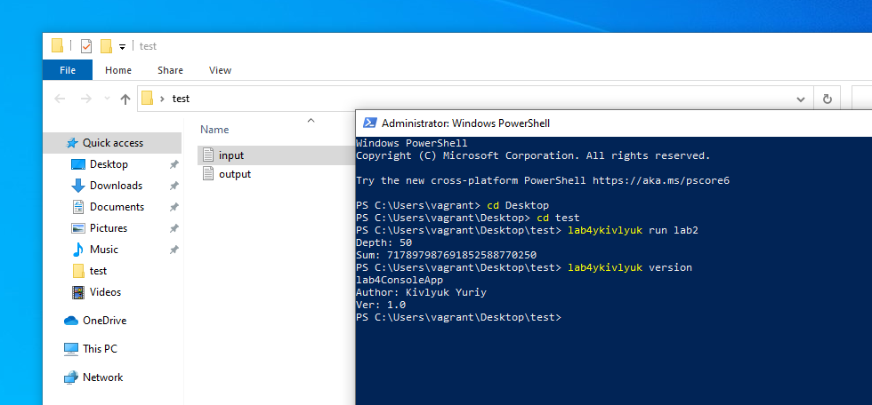

### Далі створимо конфігураційний файл Vagrant для Linux:
1) створимо файл з налаштуваннями ВМ
2) запустимо ВМ за допомогою команди vagrant up та після виконаємо provision.

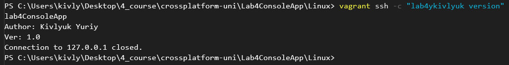

або за допогою VB: 
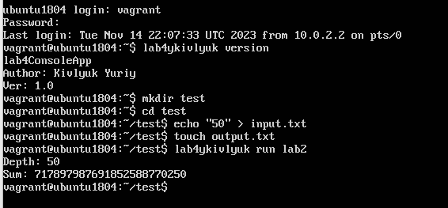

